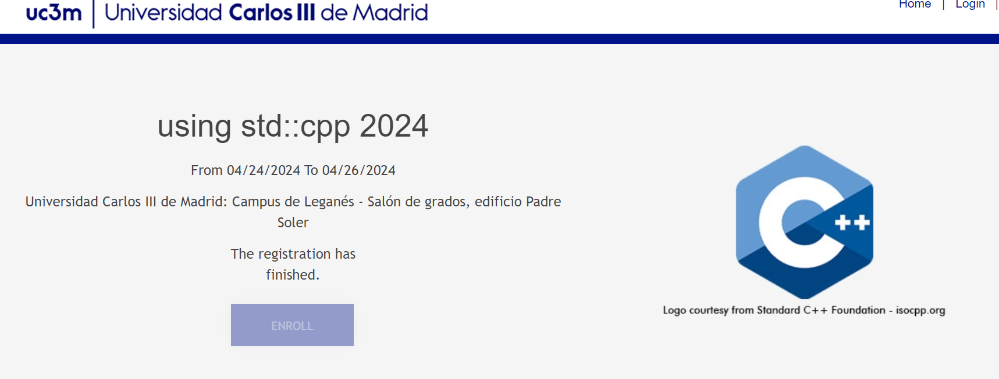
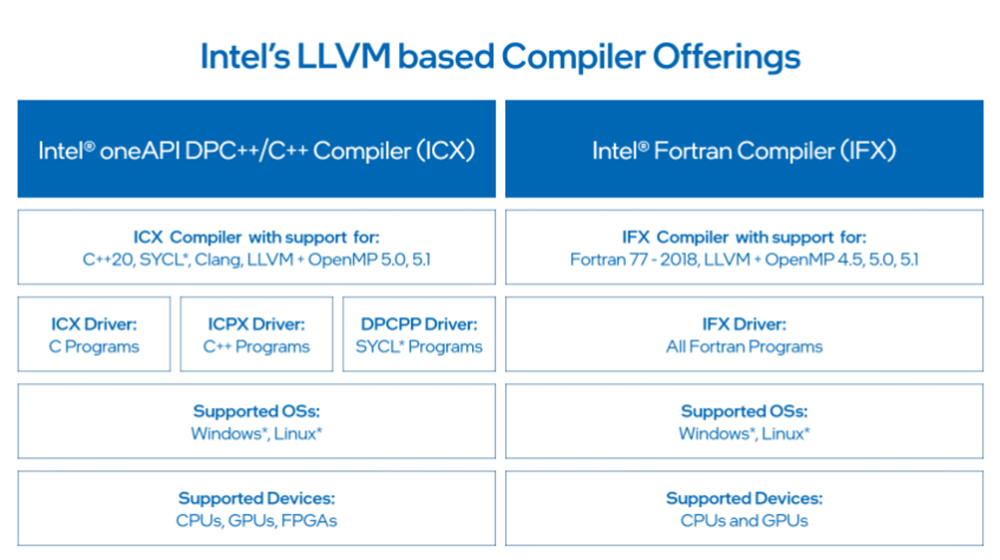
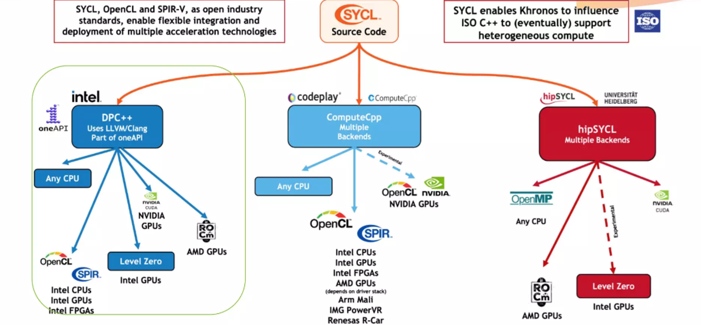
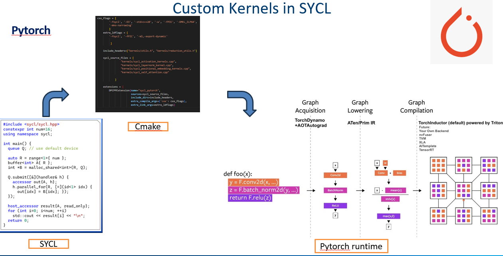
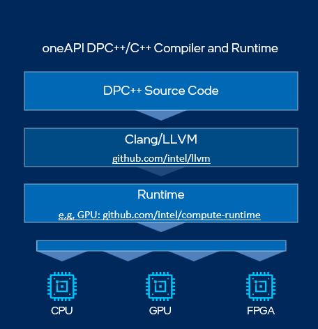

# using std::cpp 2024 Conference 

## SYCL: Integrated compiler runtime for accelerated Deep Learning 

### Abstract

LLMs and generative models have become the mainstream deep learning architectures for industries globally and with customized optimizations there is a lot of developments among deep learning compilers . However, majority of the frameworks supporting exa-scale model training/finetuning (such as Pytorch or Jax) has extensive device specific compiler runtime codes which are performant on a single specific hardware type. To democratize deep learning models and benchmark them across different runtime devices, there is a need to support a device agnostic compiler backend which can be run on Nvidia/AMD or Intel (other ISA's of x86 CPU or llvm/clang supported GPU). This talk focuses on how to create such backends using SYCL (originally from Khronos) and induce platform specific optimizations; also building abstractions on top of llvm/clang to suit SYCL runtime optimizations for GPUs /CPUs and FPGAs .The generalization of standard compiler runtime is enabling deep learning frameworks delegate device specific IR without having to write customized Api calls. 

### Contents

- Brief Introduction to LLVM Compiler Backend 
- Introduction to SYCL 
- Custom Kernels in SYCL ( along with Pytorch case study)
- DPCT (DPC++ Toolkit)
- References 
- Conclusion

#### LLVM

#### SYCL

#### Custom Kernels

#### DPCT toolkit

